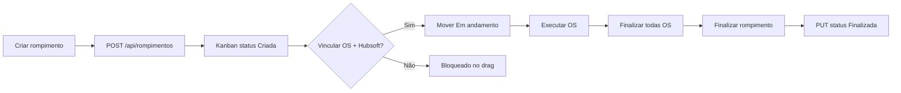
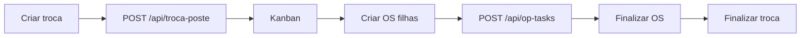

# Planner Telecom v2 — Documentação do Sistema

Documentação gerada com base no código atual do repositório. Objetivo: explicar arquitetura, fluxos e **regras de negócio**.

---

## 1. Visão geral

O **Planner Telecom** é um sistema de gestão operacional para equipes de campo. O núcleo é um **Kanban** de tarefas (`OpTask`) organizadas por **categoria** (rompimento, troca de poste, etc.), com **Ordens de Serviço (OS)** filhas vinculadas às tarefas pai.

| Camada | Tecnologia |
|--------|------------|
| Backend | Laravel (PHP), API REST |
| Autenticação | Laravel Sanctum (token Bearer) |
| Frontend | Blade + JavaScript inline |
| Notificações | Google Chat (webhooks por região) |
| Geocoding | Nominatim (OpenStreetMap) |

### Páginas disponíveis

| Rota | View | Função |
|------|------|--------|
| `/`, `/login` | `login.blade.php` | Autenticação |
| `/dashboard` | `dashboard.blade.php` | Visão geral (métricas + kanban resumido) |
| `/rompimento` | `rompimento.blade.php` | Kanban de rompimentos |
| `/troca-de-poste` | `troca-de-poste.blade.php` | Kanban de troca de poste |

Outros itens do menu lateral (Otimização, Atendimento, etc.) ainda são placeholders (`href="#"`).

---

## 2. Arquitetura

```
┌─────────────────────────────────────────────────────────────┐
│  Frontend (Blade + JS)                                      │
│  login │ dashboard │ rompimento │ troca-de-poste          │
└──────────────────────────┬──────────────────────────────────┘
                           │ fetch + Bearer token
                           ▼
┌─────────────────────────────────────────────────────────────┐
│  API REST (/api/*) — middleware auth:sanctum                │
│  AuthController │ RompimentoController │ TrocaPosteController│
│  OpTaskController │ TecnicoController                       │
└──────────────────────────┬──────────────────────────────────┘
                           │
                           ▼
┌─────────────────────────────────────────────────────────────┐
│  Services                                                   │
│  RompimentoService │ TrocaDePosteService │ OpTaskService    │
│  GoogleChatService │ TecnicoService                         │
└──────────────────────────┬──────────────────────────────────┘
                           │
                           ▼
┌─────────────────────────────────────────────────────────────┐
│  Models / Banco                                             │
│  op_tasks │ usuario │ tecnicos │ webhooks                   │
└─────────────────────────────────────────────────────────────┘
```

### Entidade central: `OpTask`

Todas as tarefas (rompimentos, trocas de poste, OS) são registros na tabela `op_tasks`, diferenciados pelo campo **`categoria`**.

Hierarquia pai ↔ filho:

```
Tarefa pai (rompimentos | troca-poste)
  └── OS filha (categoria = ordem-servico, parent_task_id = id do pai)
```

Campos principais (`app/Models/OpTask.php`):

| Campo | Uso |
|-------|-----|
| `taskCode` | Código único gerado automaticamente (ex.: `GV-ROM-001`) |
| `titulo` | Título exibido no card |
| `categoria` | Tipo da tarefa |
| `status` | Coluna do Kanban / estado da OS |
| `regiao` | Goval, Vale do Aço, Caratinga, etc. |
| `responsavel` | Técnico(s) — string, pode ser lista separada por vírgula |
| `prioridade` | Baixa, Média, Alta |
| `coordenadas` | `"lat, lng"` |
| `localizacao_texto` | Endereço |
| `cto` | Identificador CTO (rompimentos) |
| `numero_os` | Número OS Hubsoft |
| `clientesAfetados` | Quantidade (rompimentos) |
| `parent_task_id` | ID da tarefa pai (OS filhas) |
| `is_parent_task` | `true` quando a tarefa tem OS vinculadas |
| `chat_thread_key` | Thread do Google Chat para notificações |

---

## 3. Autenticação

### Fluxo

1. Usuário envia `POST /api/login` com `{ username, password }`
2. Backend valida com **PBKDF2-SHA256** (tabela `usuario`, não `users` padrão Laravel)
3. Retorna token Sanctum
4. Frontend salva em `localStorage.planner_token`
5. Requisições seguintes usam header `Authorization: Bearer {token}`

### Rotas protegidas

Todas as rotas em `routes/api.php` (exceto `POST /api/login`) exigem `auth:sanctum`.

### Observação importante

As **rotas web** (`/dashboard`, `/rompimento`, etc.) **não** têm middleware de auth. A proteção é só na API. Se o token expirar ou estiver ausente, a página abre mas as chamadas API falham (401).

---

## 4. API — Referência rápida

### Autenticação

| Método | Endpoint | Descrição |
|--------|----------|-----------|
| POST | `/api/login` | Login → `{ token, user }` |
| POST | `/api/logout` | Revoga token atual |

### Rompimentos

| Método | Endpoint | Descrição |
|--------|----------|-----------|
| GET | `/api/rompimentos` | Lista com filtros (status, região, técnico, taskCode, datas, limit, offset) |
| POST | `/api/rompimentos` | Cria rompimento |
| GET | `/api/rompimentos/{id}` | Detalhe (404 se categoria ≠ `rompimentos`) |
| PUT/PATCH | `/api/rompimentos/{id}` | Atualiza (drag, edição) |
| DELETE | `/api/rompimentos/{id}` | Exclui |
| GET | `/api/rompimentos/{id}/os` | Lista OS filhas |

### Troca de poste

| Método | Endpoint | Descrição |
|--------|----------|-----------|
| GET | `/api/troca-poste` | Lista com filtros |
| POST | `/api/troca-poste` | Cria troca de poste |
| GET | `/api/troca-poste/{id}` | Detalhe (404 se categoria ≠ `troca-poste`) |
| PUT/PATCH | `/api/troca-poste/{id}` | Atualiza |
| DELETE | `/api/troca-poste/{id}` | Exclui |
| GET | `/api/troca-poste/coordenada?coordenada=` | Reverse geocoding (Nominatim) |
| GET | `/api/troca-poste/{id}/os` | Lista OS filhas |

### Ordens de serviço (genérico)

| Método | Endpoint | Descrição |
|--------|----------|-----------|
| GET | `/api/op-tasks` | Lista até 40 tarefas (dashboard) |
| POST | `/api/op-tasks` | Cria OS filha ou tarefa genérica |
| GET | `/api/op-tasks/{id}` | Detalhe |
| PUT/PATCH | `/api/op-tasks/{id}` | Atualiza OS (edição, status inline) |
| DELETE | `/api/op-tasks/{id}` | Exclui |

Payload típico ao **criar OS**:

```json
{
  "titulo": "OS — TROCA DE POSTE",
  "responsavel": "Nome do Técnico",
  "status": "Aberta",
  "categoria": "ordem-servico",
  "parent_task_id": 123
}
```

### Técnicos

| Método | Endpoint | Descrição |
|--------|----------|-----------|
| GET | `/api/tecnicos` | Lista todos |
| GET | `/api/tecnicos?regiao=Goval` | Filtra por região |

---

## 5. Regras de negócio

### 5.1 Geração do `taskCode`

Formato: **`{SIGLA_REGIÃO}-{SIGLA_CATEGORIA}-{NNN}`**

Implementado em `OpTaskService::gerarTaskCode()`.

**Regiões:**

| Região | Sigla |
|--------|-------|
| Goval | GV |
| Vale do Aço | VA |
| Caratinga | CA |
| Desconhecida | XX |

**Categorias (siglas):**

| Categoria | Sigla |
|-----------|-------|
| rompimentos | ROM |
| troca-poste | TRO |
| otimizacao-rede | OTM |
| certificacao-cemig | CER |
| atendimento-cliente | ATE |
| manutencao-corretiva | MAN |
| correcao-atenuacao | COR |
| troca-etiqueta | ETQ |
| qualidade-potencia | QUA |
| sem-categoria | GEN |

Exemplos: `GV-ROM-001`, `VA-TRO-012`.

O número é sequencial por prefixo (3 dígitos: 001, 002…).

---

### 5.2 Status das tarefas pai (Kanban)

Valores usados em **rompimento** e **troca de poste**:

| Status | Coluna Kanban | Significado |
|--------|---------------|-------------|
| `Criada` | Criada | Estado inicial ao criar |
| `Em andamento` | Em andamento | Em execução |
| `Impedimento` | Impedimento | Bloqueio / impedimento operacional |
| `Finalizada` | Finalizada | Encerrada |

**Criação:** sempre com `status: "Criada"`.

**Mudança de status:** drag-and-drop no Kanban ou edição no modal → `PUT` na API.

---

### 5.3 Status das OS filhas

Valores usados na UI (pills e select de troca de poste):

- `Aberta`
- `Em andamento`
- `Finalizada`

**Inconsistência conhecida:** no modal de nova OS do **rompimento**, o `<select>` usa valores em minúsculas/snake (`aberta`, `em_andamento`, `finalizada`). Isso pode conflitar com a regra de finalização do backend (ver abaixo).

---

### 5.4 Hierarquia pai ↔ OS

**Ao criar OS** (`POST /api/op-tasks` com `parent_task_id`):

1. OS é criada com `categoria = ordem-servico`
2. Tarefa pai recebe `is_parent_task = true` automaticamente (`OpTaskService::createOpTask`)

**Listagem de OS:**

- Rompimento: `GET /api/rompimentos/{id}/os`
- Troca de poste: `GET /api/troca-poste/{id}/os`

Query: `parent_task_id = {id}` AND `categoria = ordem-servico`.

---

### 5.5 Regra de finalização (backend)

Ao tentar mudar o status de uma **tarefa pai** para **`Finalizada`**:

Implementado em `RompimentoService::updateRompimento()` e `TrocaDePosteService::updateTrocaDePoste()`.

```
SE existir OS filha com status != "Finalizada"
  ENTÃO abort(422, "Finalize todas as OS antes de finalizar...")
```

A comparação é **case-sensitive** com `"Finalizada"`. OS com status `finalizada` ou `Aberta` contam como pendentes.

O frontend exibe `alert()` quando recebe 422.

---

### 5.6 Regra extra — Rompimento → "Em andamento" (frontend)

**Somente no rompimento**, antes de mover para **Em andamento** via drag-and-drop:

| Condição | Obrigatório |
|----------|-------------|
| OS vinculada | `is_parent_task === true` |
| Número Hubsoft | `numero_os` preenchido no rompimento |

Se não atender, a coluna fica vermelha (`drag-bloqueado`) e o drop é bloqueado com mensagem explicativa.

**Troca de poste não tem essa regra no frontend** — qualquer transição de coluna é permitida (desde que o backend aceite).

---

### 5.7 Notificações Google Chat

Disparadas quando o **status muda** em:

- Tarefa pai (rompimento / troca de poste) — via service específico
- OS filha — via `OpTaskService::updateOpTask` (notifica no **pai**, não na OS)

**Fluxo** (`GoogleChatService`):

1. Busca webhook ativo em `webhooks` pela `regiao` da tarefa
2. Primeira mensagem cria thread no Google Chat → salva `chat_thread_key` no `OpTask`
3. Mensagens seguintes respondem na mesma thread
4. Execução após a res HTTP via `app()->terminating()`

**Limitação:** o texto do alerta está hardcoded como `"Alerta: ROMPIMENTO"` mesmo para troca de poste e OS.

**Emojis por status:**

| Status | Emoji |
|--------|-------|
| Em andamento | 🔧 |
| Impedimento | 🚨 |
| Finalizada | ✅ |
| Outros | 📋 |

---

### 5.8 Filtros e paginação (listagens)

Parâmetros de query comuns:

| Parâmetro | Descrição |
|-----------|-----------|
| `status` | Filtra coluna |
| `limit` | Quantidade por página |
| `offset` | Deslocamento |
| `regiao` | Filtra região |
| `tecnico` | Busca parcial em `responsavel` |
| `taskCode` | Código exato |
| `dataInicio` / `dataFim` | Filtra por `criadaEm` |

**Backend:** quando `status = Finalizada`, o limit sobe para **1000** (services).

**Frontend Kanban:** colunas Criada / Em andamento / Impedimento carregam 10; Finalizada carrega 50, com botão "Carregar mais".

---

### 5.9 Regiões e prioridades

**Regiões** (formulários e filtros):

- Goval
- Vale do Aço
- Caratinga
- Teste

**Prioridades:**

- Baixa
- Média (padrão)
- Alta

**Técnicos:** cadastrados em `tecnicos` (nome + região), filtrados por região nos modais.

---

## 6. Fluxos por módulo

### 6.1 Rompimento



**Campos na criação:**

- CTO, tipo/descrição, região, técnicos, clientes afetados, prioridade, coordenadas, endereço, número OS Hubsoft

**Geocoding:** Nominatim direto no front (rompimento) ou via JSON de CTOs locais.

---

### 6.2 Troca de poste



**Campos na criação:**

- Coordenadas (opcional → busca endereço), localização, região, técnicos, prioridade, número OS Hubsoft

**Geocoding:** `GET /api/troca-poste/coordenada` (Nominatim no backend).

---

### 6.3 Dashboard

- Carrega tarefas genéricas via `GET /api/op-tasks` (máx. 40)
- Kanban resumido por status (sem drag-and-drop)
- Métricas do topo são **valores estáticos** no HTML (não vêm da API)
- Mapa Leaflet com dados estáticos

---

## 7. Services — responsabilidades

| Service | Arquivo | Responsabilidade |
|---------|---------|------------------|
| `OpTaskService` | `app/Services/OpTaskService.php` | CRUD genérico, geração de taskCode, notificação ao mudar status de OS |
| `RompimentoService` | `app/Services/RompimentoService.php` | CRUD rompimentos, filtro categoria, regra de finalização, notificação |
| `TrocaDePosteService` | `app/Services/TrocaDePosteService.php` | CRUD troca de poste, geocoding, regra de finalização, notificação |
| `GoogleChatService` | `app/Services/googleChatService.php` | Webhooks, threads, montagem de mensagens |
| `TecnicoService` | `app/Services/TecnicoService.php` | Listagem de técnicos (somente leitura) |

---

## 8. Banco de dados

### Migrations versionadas

| Tabela | Migration |
|--------|-----------|
| `tecnicos` | `2026_05_22_183430_create_tecnicos_table.php` |
| `webhooks` | `2026_05_25_175547_create_webhooks_table.php` |
| `personal_access_tokens` | Sanctum |
| `op_tasks` | Apenas alterações parciais (`cto`, `numero_os`) — **create table não está no repo** |
| `usuario` | **Sem migration no repo** |

---

## 9. Pontos de atenção / dívidas técnicas

| Item | Impacto |
|------|---------|
| Status de OS inconsistentes (`Aberta` vs `aberta` vs `finalizada`) | Regra de finalização pode falhar ou bloquear incorretamente |
| Sem validação server-side nos controllers (exceto login) | Dados inválidos podem ser persistidos |
| Rotas web sem auth | Páginas abrem sem token; API retorna 401 |
| Template Google Chat fixo "ROMPIMENTO" | Notificações de troca de poste com texto errado |
| `gerarTaskCode` fallback de categoria desconhecida retorna `GV` em vez de `GEN` | Códigos potencialmente incorretos |
| `TecnicoController` apiResource sem store/update/destroy | Rotas existem mas métodos não |
| `RompimentoController::updateOs` | Referencia service não injetado (código morto) |
| Dashboard com métricas estáticas | Não reflete dados reais |
| Menu lateral com badges fixos | Não reflete contagem real |

---

## 10. Estrutura de arquivos relevante

```
app/
├── Http/Controllers/Api/
│   ├── AuthController.php
│   ├── OpTaskController.php
│   ├── RompimentoController.php
│   ├── TrocaPosteController.php
│   └── TecnicoController.php
├── Models/
│   ├── OpTask.php
│   ├── User.php
│   ├── Tecnico.php
│   └── Webhook.php
└── Services/
    ├── OpTaskService.php
    ├── RompimentoService.php
    ├── TrocaDePosteService.php
    ├── googleChatService.php
    └── TecnicoService.php

resources/views/
├── layouts/app.blade.php
├── components/modal.blade.php
├── login.blade.php
├── dashboard.blade.php
├── rompimento.blade.php
└── troca-de-poste.blade.php

routes/
├── api.php
└── web.php

public/js/
├── api/client.js
└── modules/opTask.js
```

---

## 11. Glossário

| Termo | Significado |
|-------|-------------|
| **OpTask** | Entidade genérica de tarefa no sistema |
| **Tarefa pai** | Rompimento ou troca de poste — card principal do Kanban |
| **OS filha** | Ordem de serviço vinculada (`ordem-servico` + `parent_task_id`) |
| **taskCode** | Identificador legível (ex.: GV-ROM-001) |
| **CTO** | Caixa de terminação óptica — identificador em rompimentos |
| **Hubsoft** | Sistema externo — número de OS referenciado em `numero_os` |
| **Webhook** | URL do Google Chat configurada por região |

---

*Última atualização: junho/2026 — baseada no estado atual do repositório Planner-Tecom-v2.*
